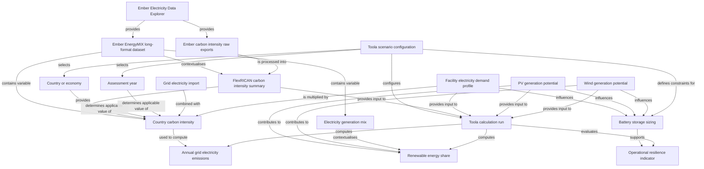

# FlexRICAN Toola Metadata Graph

This folder contains ontology-oriented metadata and relationship graph files for the FlexRICAN Toola data architecture.

The metadata describe source datasets, curated Toola input tables, calculation dependencies, provenance and output indicators using an OEMetadata-compatible structure and a subject-predicate-object relationship table.

## Toola data relationship graph

The diagram below provides a simplified visual representation of the main data dependencies in Toola.

## Files

- `oemetadata.metadata.json` – OEMetadata-compatible metadata record for the Toola relationship graph.
- `toola_data_relationships.csv` – subject-predicate-object relationship table.
- `toola_data_relationships_graph.jsonld` – JSON-LD representation of the Toola relationship graph.
- `toola_data_relationships_README.md` – detailed methodological note.

## Notes

This graph is a lightweight project-specific relationship graph. It is not a replacement for the Open Energy Ontology. It documents how Toola input datasets, assumptions, calculation steps and output indicators are connected for reproducibility, traceability and later validation.
